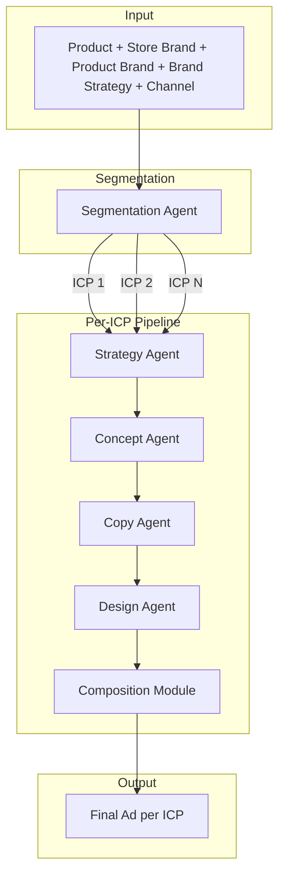

# Sartor Ad Engine: Project Architecture

> **Version:** 1.1  
> **Date:** 2026-01-09  
> **Status:** Approved for POC Development  

---

## Executive Summary

This document defines the architecture for **Sartor Ad Engine**, an automated system that generates high-fidelity static advertisements for **eCommerce products** personalized for specific customer segments. The engine takes a Product Catalog Item as input and produces ready-to-deploy static ad creatives tailored to distinct Ideal Customer Profiles (ICPs).

> [!NOTE]
> **Scope:** This system is designed for **physical goods sold via eCommerce** (DTC brands, online retailers, marketplaces). SaaS, services, and digital-only products are out of scope for this POC.

### Core Design Principles

1. **Strategy Before Creativity** — Strategic positioning is defined before any creative execution begins.
2. **Accumulated State** — Every agent has full access to all prior outputs, preventing context degradation.
3. **Separation of Concerns** — Each agent has a single, well-defined responsibility with no overlap.
4. **Deterministic Composition** — Text rendering is handled programmatically, not by image generation models.
5. **Authentic Product Representation** — Actual product images from the catalog are used, not AI-generated approximations, ensuring customer trust and legal compliance.
6. **Flexible Brand Model** — Supports both DTC (single brand) and multi-brand retailers (store + product brands) with explicit brand hierarchy strategy.

---

## System Architecture Overview

```
┌─────────────────────────────────────────────────────────────────────────────┐
│                              SYSTEM INPUT                                   │
│  ┌─────────────────┐  ┌─────────────────┐  ┌─────────────────┐              │
│  │ Product Data    │  │ Store Brand     │  │ Channel Context │              │
│  │ - Name, SKU     │  │ - Brand Voice   │  │ - Placement     │              │
│  │ - Description   │  │ - Visual Style  │  │ - Dimensions    │              │
│  │ - Features      │  │ - Color Palette │  │ - Text Limits   │              │
│  │ - Price         │  │ - Logo Asset    │  │ - Audience Fit  │              │
│  │ - Category      │  │ - Tone Keywords │  │                 │              │
│  └─────────────────┘  └─────────────────┘  └─────────────────┘              │
│                                                                             │
│  ┌───────────────────────────┐  ┌───────────────────────────────┐           │
│  │ Product Brand (Optional)  │  │ Brand Strategy                │           │
│  │ - If distinct from store  │  │ - store_dominant | product_   │           │
│  │ - Own visual identity     │  │   dominant | co_branded       │           │
│  └───────────────────────────┘  └───────────────────────────────┘           │
│                                                                             │
│  ┌─────────────────────────────────────────────────────────────┐            │
│  │ Store Context (Optional)                                    │            │
│  │ - Customer Base Summary  - Price Positioning  - Competitors │            │
│  └─────────────────────────────────────────────────────────────┘            │
└─────────────────────────────────────────────────────────────────────────────┘
                                    │
                                    ▼
┌─────────────────────────────────────────────────────────────────────────────┐
│                          AGENT ORCHESTRATION LAYER                          │
│                              (LangGraph State Machine)                      │
└─────────────────────────────────────────────────────────────────────────────┘
                                    │
        ┌───────────────────────────┼───────────────────────────┐
        │                           │                           │
        ▼                           ▼                           ▼
   ┌─────────┐                 ┌─────────┐                 ┌─────────┐
   │  ICP 1  │                 │  ICP 2  │                 │  ICP N  │
   └────┬────┘                 └────┬────┘                 └────┬────┘
        │                           │                           │
        ▼                           ▼                           ▼
┌───────────────────────────────────────────────────────────────────────────┐
│                                                                           │
│    ┌──────────────┐    ┌──────────────┐    ┌──────────────┐               │
│    │  STRATEGY    │───►│   CONCEPT    │───►│    COPY      │               │
│    │    AGENT     │    │    AGENT     │    │    AGENT     │               │
│    └──────────────┘    └──────────────┘    └──────────────┘               │
│                                                  │                        │
│                                                  ▼                        │
│                              ┌──────────────────────────────────┐         │
│                              │          DESIGN AGENT            │         │
│                              │   (Generates Scene/Background)   │         │
│                              └───────────────┬──────────────────┘         │
│                                              │                            │
│                                              ▼                            │
│                              ┌──────────────────────────────────┐         │
│                              │      COMPOSITION MODULE          │         │
│                              │  (Deterministic Text Overlay)    │         │
│                              └───────────────┬──────────────────┘         │
│                                              │                            │
│                                              ▼                            │
│                              ┌──────────────────────────────────┐         │
│                              │       FINAL STATIC AD            │         │
│                              └──────────────────────────────────┘         │
│                                                                           │
│                           PER-ICP PIPELINE (Parallel Execution)           │
└───────────────────────────────────────────────────────────────────────────┘
```

---

## Input Schema

### 1. Product Data (Required)

| Field | Type | Description |
|-------|------|-------------|
| `product_id` | string | Unique identifier (SKU) |
| `name` | string | Product display name |
| `description` | string | Full product description |
| `features` | list[string] | Key product features/specs |
| `benefits` | list[string] | Customer-facing benefits |
| `price` | object | `{ value, currency, compare_at_price }` |
| `category` | string | Product category/taxonomy |
| `images` | list[string] | Product image URLs |
| `metadata` | object | Any additional attributes |

### 2. Store Brand (Required)

The **store brand** is the retailer or store running the ads. This is always required.

| Field | Type | Description |
|-------|------|-------------|
| `brand_name` | string | Store/retailer name |
| `brand_voice` | string | Description of brand personality (e.g., "Premium, minimalist, tech-forward") |
| `tone_keywords` | list[string] | Adjectives defining tone (e.g., ["confident", "aspirational", "warm"]) |
| `visual_style` | string | Visual identity description (e.g., "Clean lines, dark backgrounds, bold typography") |
| `color_palette` | object | `{ primary, secondary, accent, background }` hex codes |
| `logo_url` | string | Store logo asset URL |
| `tagline` | string | Store tagline (if applicable) |

### 3. Product Brand (Optional)

The **product brand** is the manufacturer or product-level brand identity. Only required if the product has a distinct brand from the store (e.g., Sony products sold at Best Buy).

| Field | Type | Description |
|-------|------|-------------|
| `brand_name` | string | Manufacturer/product brand name |
| `brand_voice` | string | Product brand personality |
| `tone_keywords` | list[string] | Tone adjectives |
| `visual_style` | string | Product brand visual identity |
| `color_palette` | object | Product brand colors |
| `logo_url` | string | Product brand logo URL |
| `tagline` | string | Product brand tagline (if applicable) |

### 4. Brand Strategy (Required)

Defines how store and product brands should be balanced in the ad creative.

| Field | Type | Description |
|-------|------|-------------|
| `strategy` | enum | `"store_dominant"` \| `"product_dominant"` \| `"co_branded"` |

| Strategy | When to Use | Visual Result |
|----------|-------------|---------------|
| `store_dominant` | DTC, or retailer selling unbranded/weak-brand products | Ad uses store's visual identity, logo, tone |
| `product_dominant` | Retailer selling strong product brands (Sony, Nike) | Ad looks like a product brand ad, with "Available at [Store]" |
| `co_branded` | Partnerships, exclusives, collaborations | Both logos, blended visual identity |

### 5. Channel Context (Required)

| Field | Type | Description |
|-------|------|-------------|
| `platform` | string | Target platform (e.g., "Facebook", "Instagram", "Google Display") |
| `placement` | string | Specific placement (e.g., "Feed", "Stories", "Banner") |
| `dimensions` | object | `{ width, height }` in pixels |
| `text_constraints` | object | `{ headline_max_chars, body_max_chars, cta_max_chars }` |
| `audience_context` | string | Platform-specific audience notes |

### 6. Store Context (Optional)

| Field | Type | Description |
|-------|------|-------------|
| `customer_summary` | string | Description of typical customer base |
| `price_positioning` | string | "budget" \| "mid-range" \| "premium" \| "luxury" |
| `competitors` | list[string] | Key competitor names |
| `store_statistics` | object | Historical performance data if available |

---

## Agent Definitions

### Agent 1: Segmentation Agent

> **Mission:** Identify distinct Ideal Customer Profiles (ICPs) who would purchase this product.

| Attribute | Specification |
|-----------|---------------|
| **Input** | Product Data, Store Brand, Product Brand (if applicable), Brand Strategy, Store Context |
| **Output** | List of 2-4 ICPs with structured profiles |
| **Tools** | Web search for market research |
| **LLM** | High-reasoning model (e.g., Gemini 2.0 Flash Thinking) |

#### Output Schema: `ICP`

```json
{
  "icp_id": "string",
  "name": "string (e.g., 'Tech-Forward Professional')",
  "demographic": {
    "age_range": "string",
    "gender": "string | null",
    "income_level": "string",
    "location_type": "string"
  },
  "psychographics": {
    "values": ["list of core values"],
    "lifestyle": "string",
    "aspirations": "string"
  },
  "behavioral_triggers": {
    "purchase_motivators": ["list"],
    "objections": ["list"],
    "decision_factors": ["list"]
  },
  "communication_preferences": {
    "tone": "string",
    "vocabulary_level": "string",
    "responds_to": ["emotional appeals | data | social proof | urgency"]
  }
}
```

---

### Agent 2: Strategy Agent

> **Mission:** Define the strategic positioning for this product targeting this specific ICP.

| Attribute | Specification |
|-----------|---------------|
| **Input** | Full accumulated state (Product, Store Brand, Product Brand, Brand Strategy, Channel, ICP) |
| **Output** | Strategic Brief per ICP |
| **LLM** | High-reasoning model (e.g., Gemini 2.0 Pro, Claude Sonnet) |

#### Output Schema: `StrategicBrief`

```json
{
  "icp_id": "string",
  "positioning_statement": "string (For [ICP] who [need], [Product] is the [category] that [key differentiator])",
  "primary_pain_point": "string (The specific problem we solve)",
  "key_benefit": "string (Single most compelling benefit for this ICP)",
  "proof_point": "string (Evidence: feature, stat, or claim that supports the benefit)",
  "emotional_appeal": "string (The feeling we want to evoke)",
  "tone_of_voice": "string (Specific tone for this ICP, aligned with brand voice)",
  "message_hierarchy": ["primary message", "secondary message", "tertiary message"]
}
```

---

### Agent 3: Concept Agent

> **Mission:** Develop the creative Big Idea and visual layout direction that will bring the strategy to life.

| Attribute | Specification |
|-----------|---------------|
| **Input** | Full accumulated state (Product, Store Brand, Product Brand, Brand Strategy, Channel, ICP, Strategy) |
| **Output** | Creative Concept per ICP |
| **LLM** | Creative-capable model (e.g., Claude Sonnet, GPT-4o) |

#### Output Schema: `CreativeConcept`

```json
{
  "icp_id": "string",
  "big_idea": "string (The unifying creative concept in one sentence)",
  "visual_metaphor": "string | null (If applicable, the visual analogy used)",
  "layout_archetype": "string (e.g., 'Problem/Solution Split', 'Hero Product with Stat Overlay', 'Lifestyle Context Shot')",
  "scene_description": "string (Detailed description of the background/context scene, excluding product and text)",
  "product_placement": {
    "position": "string (e.g., 'center', 'left-third', 'bottom-right')",
    "size": "string ('dominant' | 'balanced' | 'subtle')",
    "treatment": "string (e.g., 'floating with shadow', 'on surface', 'held by hand')"
  },
  "mood": "string (e.g., 'Energetic and bold', 'Calm and sophisticated')",
  "color_direction": "string (How brand colors should be applied)",
  "focal_point": "string (What the eye should be drawn to first)"
}
```

---

### Agent 4: Copy Agent

> **Mission:** Write the ad copy—headline, body, and CTA—tailored to the ICP and aligned with the concept.

| Attribute | Specification |
|-----------|---------------|
| **Input** | Full accumulated state (Product, Store Brand, Product Brand, Brand Strategy, Channel, ICP, Strategy, Concept) |
| **Output** | Ad Copy per ICP |
| **LLM** | Strong language model (e.g., Gemini 2.0 Flash, Claude Sonnet) |

#### Output Schema: `AdCopy`

```json
{
  "icp_id": "string",
  "headline": "string (Attention-grabbing, within channel constraints)",
  "subheadline": "string | null (Optional secondary headline)",
  "body_copy": "string (Supporting message, within channel constraints)",
  "cta_text": "string (Call-to-action button text)",
  "cta_urgency": "string | null (Optional urgency element)",
  "legal_disclaimer": "string | null (If required)"
}
```

#### Copy Constraints (Enforced by Agent)

- Headline: ≤ `channel.text_constraints.headline_max_chars`
- Body: ≤ `channel.text_constraints.body_max_chars`  
- CTA: ≤ `channel.text_constraints.cta_max_chars`

---

### Agent 5: Design Agent

> **Mission:** Generate the visual background/context scene for the ad. **Does NOT include text or the product itself.**

| Attribute | Specification |
|-----------|---------------|
| **Input** | Full accumulated state (Product, Store Brand, Product Brand, Brand Strategy, Channel, ICP, Strategy, Concept, Copy) |
| **Output** | Background scene image (no text, no product) |
| **Model** | Image generation model (e.g., Imagen 3, Flux 1.1 Pro) |

#### Output

- **Primary Output:** Background image file (PNG/JPEG) at specified `channel.dimensions`
- **Metadata:** Image generation prompt used (for debugging/iteration)

#### Key Constraints

> [!IMPORTANT]
> The Design Agent outputs a **text-free, product-free background scene**. The actual product image and all text are composited in the Composition Module. This ensures:
> 1. **Product authenticity** — customers see the real product they're purchasing
> 2. **Text legibility** — programmatic text rendering is reliable
> 3. **Brand compliance** — fonts, colors, and logo placement are deterministic

---

### Composition Module (Deterministic)

> **Mission:** Composite the product image and text onto the background scene to produce the final ad.

| Attribute | Specification |
|-----------|---------------|
| **Input** | Background scene + Product image(s) + AdCopy + Brand assets (fonts, colors, logo) + Concept (for placement) |
| **Output** | Final static ad image with product and text |
| **Implementation** | Programmatic (e.g., Pillow, Cairo, HTML/CSS template, Figma API) |

This is **not an LLM agent**. It is a deterministic code module that:

1. Takes the background scene image as the base layer
2. **Composites the actual product image** from `product.images` using placement directives from `concept.product_placement`
3. Applies text overlay (headline, body, CTA) using brand-approved fonts and colors
4. Positions text according to the `layout_archetype` from Concept Agent
5. Adds logo and any required legal text
6. Exports final image at required dimensions

> [!NOTE]
> Product image compositing may require background removal (using tools like `rembg` or similar) if the source product image has a non-transparent background. This is handled within the Composition Module.

---

## State Management

### Accumulated State Object

All agents read from and write to a single `AdCreationState` object:

```python
@dataclass
class AdCreationState:
    # Inputs (immutable after initialization)
    product: ProductData
    store_brand: BrandContext
    product_brand: BrandContext | None  # Only if distinct from store
    brand_strategy: BrandStrategy  # "store_dominant" | "product_dominant" | "co_branded"
    channel: ChannelContext
    store_context: StoreContext | None
    
    # Agent Outputs (populated sequentially)
    icps: list[ICP] = field(default_factory=list)
    strategies: dict[str, StrategicBrief] = field(default_factory=dict)  # keyed by icp_id
    concepts: dict[str, CreativeConcept] = field(default_factory=dict)
    copy: dict[str, AdCopy] = field(default_factory=dict)
    scenes: dict[str, ImageAsset] = field(default_factory=dict)
    final_ads: dict[str, ImageAsset] = field(default_factory=dict)
    
    # Metadata
    run_id: str
    created_at: datetime
    errors: list[ErrorLog] = field(default_factory=list)
```

### State Flow

```
┌────────────────────────────────────────────────────────────────────┐
│                         AdCreationState                            │
├────────────────────────────────────────────────────────────────────┤
│ INIT:    product, store_brand, product_brand, brand_strategy,      │
│          channel, store_context                                    │
├────────────────────────────────────────────────────────────────────┤
│ AFTER SEGMENTATION:  + icps                                        │
├────────────────────────────────────────────────────────────────────┤
│ AFTER STRATEGY:      + strategies[icp_id]                          │
├────────────────────────────────────────────────────────────────────┤
│ AFTER CONCEPT:       + concepts[icp_id]                            │
├────────────────────────────────────────────────────────────────────┤
│ AFTER COPY:          + copy[icp_id]                                │
├────────────────────────────────────────────────────────────────────┤
│ AFTER DESIGN:        + scenes[icp_id]                              │
├────────────────────────────────────────────────────────────────────┤
│ AFTER COMPOSITION:   + final_ads[icp_id]                           │
└────────────────────────────────────────────────────────────────────┘
```

---

## Execution Flow



### Parallelization Strategy

- **Segmentation:** Single execution (produces all ICPs)
- **Strategy → Copy:** Sequential per ICP, but **different ICPs can run in parallel**
- **Design → Composition:** Sequential per ICP (Design must complete before Composition)

---

## Proposed Technical Stack (POC)

| Component | Recommendation | Rationale |
|-----------|----------------|-----------|
| **Orchestration** | LangGraph | Native support for stateful, sequential workflows with parallel branches |
| **LLM (Strategy/Concept)** | Gemini 2.0 Pro or Claude Sonnet 4 | Strong reasoning and creative capabilities |
| **LLM (Copy)** | Gemini 2.0 Flash | Fast, cost-effective, excellent for constrained text generation |
| **LLM (Segmentation)** | Gemini 2.0 Flash Thinking | Research-heavy task benefits from extended reasoning |
| **Image Generation** | Imagen 3 or Flux 1.1 Pro | High-quality scene generation with good prompt adherence |
| **Composition** | Pillow + HTML/CSS Templates | Simple, deterministic, no external API dependencies |
| **State Persistence** | SQLite (POC) → PostgreSQL (Production) | Lightweight for POC, scalable for production |
| **Asset Storage** | Local filesystem (POC) → Cloud Storage (Production) | Simplicity for POC |

---

## Key Architectural Decisions

### Decision 1: Strategy Before Concept

> **Rationale:** Creative execution must be anchored in strategic positioning. The Strategy Agent defines *what* to communicate; the Concept Agent defines *how*. This prevents creative drift and ensures every visual choice serves a strategic purpose.

### Decision 2: Separate Copy and Design Agents

> **Rationale:** Text and visuals have different failure modes. LLMs excel at copywriting but are irrelevant for image generation. Image models excel at scenes but fail at text rendering. Separating them allows each to do what it does best.

### Decision 3: Deterministic Composition for Text

> **Rationale:** Current image generation models cannot reliably render text. By extracting text composition into a deterministic code module, we guarantee legibility, brand compliance, and typographic consistency.

### Decision 4: Full State Visibility for All Agents

> **Rationale:** Passing only the immediate prior output creates a "telephone game" effect where context degrades. Every agent sees the complete accumulated state, including original product data, brand guidelines, and all prior outputs.

### Decision 5: ICP-Parallel, Step-Sequential

> **Rationale:** Different ICPs are independent; they can be processed in parallel. But within a single ICP, steps must be sequential (you can't write copy before defining the concept). This maximizes throughput while maintaining logical dependencies.

### Decision 6: Actual Product Images Over AI Generation

> **Rationale:** For eCommerce, customers must see the exact product they're purchasing. AI-generated product representations risk inaccuracy (wrong color, shape, details), erode customer trust, and may create legal/compliance issues. The Design Agent generates only the background context; the Composition Module overlays the authentic product image from the catalog.

### Decision 7: Flexible Brand Hierarchy

> **Rationale:** eCommerce spans multiple business models: DTC brands (store = product brand), multi-brand retailers (store ≠ product brand), and collaborations. Rather than forcing one model, we support all three via explicit `brand_strategy`. This determines which brand's visual identity and tone dominate the ad, with clear rules for logo placement and secondary brand mentions.

---

## Appendix A: Glossary

| Term | Definition |
|------|------------|
| **ICP** | Ideal Customer Profile — a detailed persona representing a target customer segment |
| **Big Idea** | The central creative concept that unifies the visual and verbal elements of an ad |
| **Layout Archetype** | A standardized visual structure (e.g., "Hero Product Shot," "Problem/Solution Split") |
| **Strategic Brief** | A document defining the positioning, key benefit, proof points, and tone for a specific ICP |
| **Scene Image** | The visual background/environment of an ad, generated without text |
| **Composition** | The process of overlaying text onto a scene image to produce a final ad |
| **Store Brand** | The retailer/store identity running the ads (always present) |
| **Product Brand** | The manufacturer/product brand identity (only if distinct from store) |
| **Brand Strategy** | How store and product brands are balanced: store_dominant, product_dominant, or co_branded |

---

## Appendix B: Example Inputs (Reference)

### Example 1: DTC Brand (Store = Product Brand)

```json
{
  "product": {
    "name": "AeroFlow Pro Wireless Headphones",
    "description": "Premium active noise-canceling headphones with 40-hour battery life",
    "features": ["Hybrid ANC", "40hr battery", "Bluetooth 5.3", "Lightweight titanium frame"],
    "price": { "value": 349, "currency": "USD" },
    "category": "Electronics > Audio > Headphones"
  },
  "store_brand": {
    "brand_name": "SoundScale",
    "brand_voice": "Premium, tech-forward, minimalist",
    "tone_keywords": ["confident", "innovative", "refined"],
    "color_palette": { "primary": "#1A1A2E", "accent": "#E94560" },
    "logo_url": "https://example.com/soundscale-logo.png"
  },
  "product_brand": null,
  "brand_strategy": "store_dominant",
  "channel": {
    "platform": "Instagram",
    "placement": "Feed",
    "dimensions": { "width": 1080, "height": 1080 },
    "text_constraints": { "headline_max_chars": 40, "body_max_chars": 125, "cta_max_chars": 20 }
  }
}
```

### Example 2: Multi-Brand Retailer (Store ≠ Product Brand)

```json
{
  "product": {
    "name": "Sony WH-1000XM5 Wireless Headphones",
    "description": "Industry-leading noise cancellation with 30-hour battery",
    "features": ["Adaptive ANC", "30hr battery", "Multipoint connection", "Speak-to-Chat"],
    "price": { "value": 399, "currency": "USD", "compare_at_price": 449 },
    "category": "Electronics > Audio > Headphones"
  },
  "store_brand": {
    "brand_name": "TechMart",
    "brand_voice": "Friendly, helpful, value-focused",
    "tone_keywords": ["approachable", "trustworthy", "expert"],
    "color_palette": { "primary": "#0066CC", "accent": "#FF6600" },
    "logo_url": "https://example.com/techmart-logo.png"
  },
  "product_brand": {
    "brand_name": "Sony",
    "brand_voice": "Innovative, premium, professional",
    "tone_keywords": ["cutting-edge", "quality", "precision"],
    "color_palette": { "primary": "#000000", "accent": "#0072CE" },
    "logo_url": "https://example.com/sony-logo.png"
  },
  "brand_strategy": "product_dominant",
  "channel": {
    "platform": "Facebook",
    "placement": "Feed",
    "dimensions": { "width": 1200, "height": 628 },
    "text_constraints": { "headline_max_chars": 50, "body_max_chars": 150, "cta_max_chars": 25 }
  }
}
```

### Example Output (DTC, One ICP Path)

**ICP:** "Remote Work Professional"  
**Strategy:** Position as productivity tool, pain point is Zoom fatigue  
**Concept:** Split-screen showing chaotic open office vs. serene focus with headphones  
**Copy:** Headline: "Your Focus, Engineered" | CTA: "Shop Now"  
**Scene:** Minimalist workspace, soft lighting, headphones as hero object  
**Final Ad:** Composed image with SoundScale branding, headline overlay, and CTA button

### Example Output (Multi-Brand Retailer, One ICP Path)

**ICP:** "Audiophile Upgrader"  
**Strategy:** Position as ultimate upgrade, pain point is subpar audio quality  
**Concept:** Hero product shot with premium aesthetic, sound waves visualization  
**Copy:** Headline: "Hear What You've Been Missing" | CTA: "Shop at TechMart"  
**Scene:** Dark gradient background with subtle sound wave graphics  
**Final Ad:** Sony branding dominant, "Available at TechMart" in corner, product hero shot

---

*Document maintained by: [Team Lead Name]*  
*Last reviewed: 2026-01-09*
